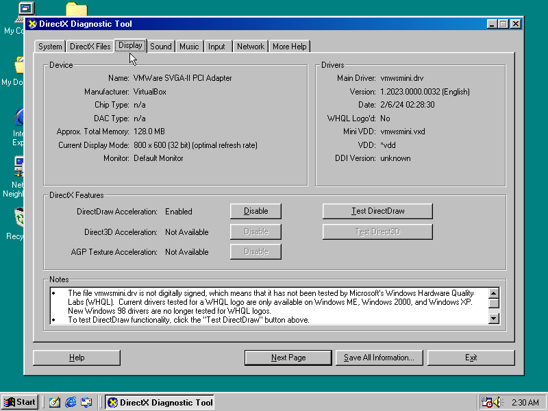

# VMHAL9x

This is DirectDraw HAL implementation for [VMDisp9x](https://github.com/JHRobotics/vmdisp9x) driver.

## Usage

Binaries will be included with [VMDisp9x releases](https://github.com/JHRobotics/vmdisp9x/releases). When you install the driver, DirectDraw should be available automatically. You can check it with `dxdiag` utility.




## DirectDraw

Microsoft DirectDraw (**DD**) is relatively simple API for HW accelerated drawing (2D only). Often used by 2D games (usually real-time strategies, adventures) without request of 3D rendering and requirement to DirectX. Or by earlier 3D games with software renderer and with demand for fast frame-buffer rendering/double buffering.


## Limitation

Good **DD** implementation requited only a few HW things:
1) Linear frame buffer access
2) HW cursor support
3) Moveable visible screen frame-buffer position (flip)
4) Electron beam timing informations for non tearing

All other action (color-space conversion, blit) can be done by software, on current CPUs slowdown isn't notable (*yes, of course on 486 this was a bottleneck*).

But with virtual machine's GPU there are some problems: first point is without problem (you can access whole VRAM although you cannot use VRAM like real VRAM for 3D texture storage).

BUT HW cursor works only on VMware SVGA SVGA-II adapter and only on 32 bpp mode (near all **DD** games working on 640x480/800x600 16 bpp mode). Software cursor is a really annoying because you have to erase it before any frame-buffer operation and draw it back after it.

HW frame-buffer flipping is supported only on Bochs VBE like virtual GPUs (*VBoxVGA* adapter in VirtualBox, *STD VGA* in QEMU). On VMware SVGA-II HW flipping really works only on 32 bpp mode (same as HW cursor) and it's slow - so I emulate this behaviour by copying whole target surface to visible frame buffer (it's slow and sometimes displays artefacts).

Tearing is situation where you see on screen part of old picture and part on new picture in same time. This was a very uncomfortable effect on CRT[^1] screens. **DD** is calculating where is actual position of electron beam - it can be showing (you shouldn't do any operation with actual frame-buffer), it can be in horizontal black porch (beam is returning to the begin of a next line, you can do some special effect like rain or snow) or it can be in vertical black porch (beam is returning to the begin of the screen, you can do flipping here or do drawing on single frame-buffer rendering). There is no way, how obtain real screen timing information from virtual machine but good news is, that screen buffer from VM is every time double buffered (technically you cannot access same memory from VM and from user-space on real machine same time) and with LCD screens isn't tearing as visible as with on old CRT. This behaviour is fully emulated and result timing is similar to 60-Hz screen.

[^1]: Cathode-ray tube

## HAL vs. HEL

HAL = hardware abstraction layer. HEL = hardware emulation layer. Application using *DD* should check if functionality is available by HAL and if not pass it to HEL to emulate behaviour. Unlike DirectX, HEL is able to completely and relatively fast emulate all HAL behaviour. Why need to implement HAL? Because lots of applications denied to work when HAL is unavailable.

## Code

DD HAL is relative normal looking DLL with one exception, you have to loaded it to shared space (from `0x80000000` to `0xBFFFFFFF`) and code and data section have to be marked as shared (`IMAGE_SCN_MEM_SHARED` flag). Microsoft linker has some legacy option to do it (`/SHARED`), but it cannot be done with GCC/LD (`-shared` option on GCC produces shared library aka DLL, equivalent `/DLL` for MSC). So I wrote utility called *makeshared* (source `makeshared.c`) that adds `IMAGE_SCN_MEM_SHARED` flag to all important PE[^2] sections and recalculates image hash. If you want to use this utility in another project, you can free to do it, but don't forget to set image base (`--image-base` on LD or `-Wl,--image-base` on GCC) above 2G space.

This behaviour is required because the driver (VDD) is still 16 bit (Window 3.0 compatibility with Intel 286 compatibility) and it needs to call 32 bit code and interchange data with it (in theory you can write whole HAL in 16 bit code, but there is no reason why to do it, with regard to accessing more than 64 kB in one segment = 800x600 16bpp screen is 937 kB and 128 MB VRAM is more than you can map into 16-bit space on same time).

And one more limitation, library is loaded once after **DD* is first time loaded and resides in memory until system shut down. All library's memory is persistent but all opened resources are only valid in process where was created. So if you open file and save a *HANDLE* to `static` variable, the resource descriptor will be present in another process but it'll be invalid.

[^2]: PE = portable image = EXE or DLL file on Windows

## Compilation

Copy `config.mk-sample` to `config.mk` and follow instructions in this file. Please note, that on non win32 compatible systems, you've to set different `CC` (mingw32) and `HOST_CC` (your native C compiler) values. When it's done, type make

```
make
```

Result is file named `vmhal9x.dll`.

## Installation

Copy `vmhal9x.dll` to `C:\WINDOWS\SYSTEM`. When you have corresponding driver [vmdisp9x](https://github.com/JHRobotics/vmdisp9x) >= **v1.2024.0.32**), DirectDraw will be enabled automatically. 


## DirectX

DirectX support is planned, meantime you can use [wine9x](https://github.com/JHRobotics/wine9x/) to emulate this though OpenGL.


## TODO

- DirectX
- Accelerate frequently used ROP3 BLITs (0xCC, 0xF0). 

